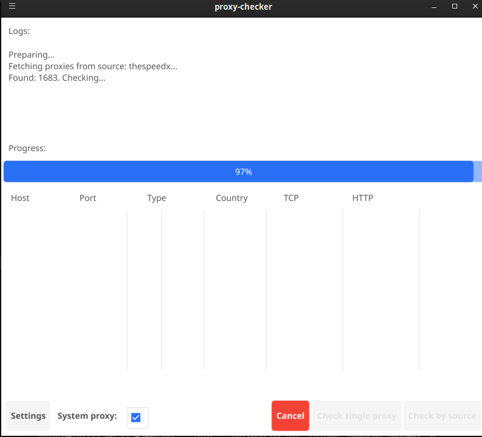
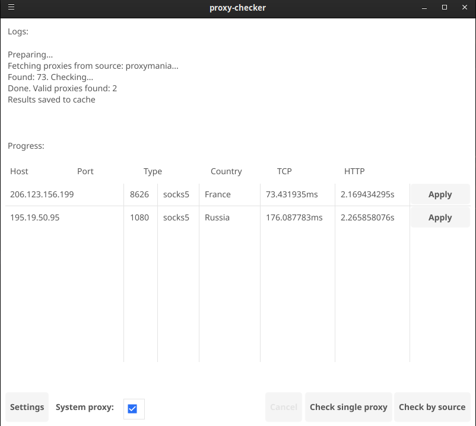

# Proxy Checker

A fast, concurrent proxy parser and checker with a native cross-platform GUI and a powerful CLI. Written in Go.

## Features

- **Multi-protocol Support:** Check HTTP, HTTPS, SOCK4, and SOCK5 proxies.
- **Dual Interface:** 
  - **Native GUI:** Built with [Fyne v2](https://fyne.io/). Features an adaptive, scalable data table, real-time logs, and progress tracking.
   - **CLI:** Perfect for automation, scripting, and integration with other tools.
- **Multiple Parsing Sources:** 
  - `proxymania.su`: Parses interactive pages with filtering by response time (RTT) and protocol. Supports pagination.
  - `thespeedx: Fetches raw lists directly from GitHub repositories.
- **High Performance:** 
  - Highly concurrent checking using worker pools.
  - Strict `context.Context` timeout management (prevents goroutine leaks on cancellation, even with SOCK5).
  - HTTP Keep-Alive connection pooling for faster subsequent checks.
- **System Integration (Linux/GNOME):** One-click application of a working proxy to the OS system settings directly from the GUI.
- **Flexible Targeting:** Test proxies against predefined targets (Google, YouTube, ChatGPT, Telegram) or any custom URL.
- **Clean Architecture:** Strict separation of concerns (`CLI`, `GUI`, `Services`, `Fetchers`, `Config`). Strongly typed domain models.

## Screenshots





## Installation & Building

### Prerequisites
- Go 1.25 or higher
- Make (optional, for using the Makefile)
- C compiler (GCC/Clang) and development libraries (required by Fyne for GUI compilation)

### Build from source

Clone the repository and build the binary:

```bash
git clone https://github.com/yourusername/proxy-checker.git
cd proxy-checker
```

### Build the binary to ./bin/proxy-checker
```bash
make build
```

### Run the binary as ./bin/proxy-checker
```bash
make run
```

### Install (Linux)

To install the binary system-wide (`/usr/bin/`), copy the application icon, and create a desktop shortcut:

```bash
sudo make install
```
*(Note: Ensure your `assets/proxy-checker.png` exists before running install).*

## Usage

### GUI Mode

Simply run the executable. By default, it launches the graphical interface.

```bash
# CLI
./bin/proxy-checker -proxies-stat -lang en -check -rtt 150 -source proxymania -dest some-host.com -type socks5

# GUI
./bin/proxy-checker -gui
```

**GUI Workflow:**
1. Open **Settings** (top-right menu) to configure the proxy source, type, timeouts, threads, and target website.
2. Click **"Проверить по источнику*" (Check by source) to fetch and validate proxies.
3. View real-time logs and progress.
4. Once finished, use the **"Паверкатии"** (Apply) button in the table to set the selected proxy as your system proxy (GNOME-based desktops).

### CLI Mode

The CLI is designed for quick checks and pipeline scripting.

**Check a single proxy:**
```bash
./bin/proxy-checker -proxy "1.2.3.4:1080" -type socks5 -dest "https://google.com"
```

**Fetch a list of proxies (without checking):**
```bash
./bin/proxy-checker -proxies-stat -source proxymania -type socks5 -rtt 100 -pages 2
```

**Fetch and check proxies concurrently:**
```bash
./bin/proxy-checker -proxies-stat -source thespeedx -type socks5 -check -workers 128 -timeout 10s
```

### CLI Flags

| Flag | Description | Default |
| :-- | :-- | :-- |
| `-gui` | Run in graphical interface mode | `false` |
| `-proxy` | Address of a single proxy to check (`host:port`) | - |
| `-dest` | Target URL to check the proxy against | `https://google.com` |
| `-type` | Proxy type (`http`, `https`, `socs4`, `sock�`, `all`) | `sock�` |
| `-proxies-stat` | Enable mode to fetch proxy lists | `false` |
| `-check` | Must be used with `-proxies-stat`. Performs actual validation | `false` |
| `-source` | Source for fetching (`proxymania`, `thespeedx`) | `proxymania` |
| `-rtt` | Max response time in ms for `proxymaniap source | `150` |
| `-pages` | Number of pages to parse from `proxymania` | `4` |
| `-workers` | Number of concurrent checking threads | `256` |
| `-timeout` | Timeout for a single proxy check | `10s` |

## Configuration

Proxy Checker uses a TOML settings file located at `~/.config/proxy-checker.conf`.

If the file does not exist, it is automatically created with default values on the first run.

**Example `proxy-checker.conf`:**
```toml
type = "socks5"
timeout = "3s"
workers = 512
dest_addr = "youtube.com"
source = "proxymania"
rtt = 150
pages = 5
theme = "light"
min_height = 480
min_width = 640
check_http2 = false
log_path = "/tmp/proxy-checker.log"
cache_ttl = 3600
lang = "en"
```
*Note: CLI flags override the values defined in the configuration file.*

## Project Structure

The project follows standard Go layout principles with clean separation between interfaces and business logic:

```text
.
... cmd/proxy-checker/   # Application entry point
... internal/
    - cli/              # Command line interface and argument parsing
    - common/           # Shared domain types (ProxyType, Source)
    - config/           # TOML settings loading, saving, and validation
    - gui/              # Fyne v2 graphical interface (windows, widgets)
    - proxies/          # Low-level proxy dialers (SOCK4/5, HTTP)
    - services/         # Core business logic (checking, fetching pipeline)
        - fetcher/      # Web scrapers for different proxy sources
... assets/             # Icons and static resources
... Makefile
```

## Contributing

Pull requests are welcome. For major changes, please open an issue first to discuss what you would like to change.

## License

[MIT](LICENSE)
